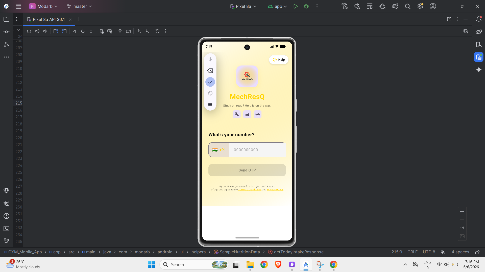
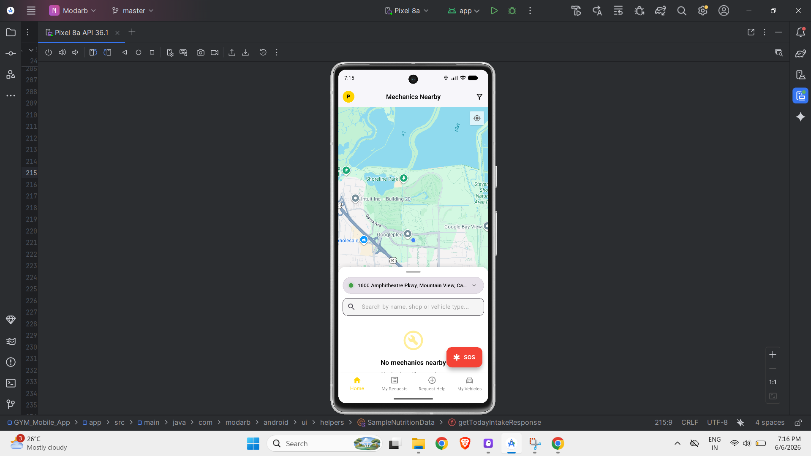
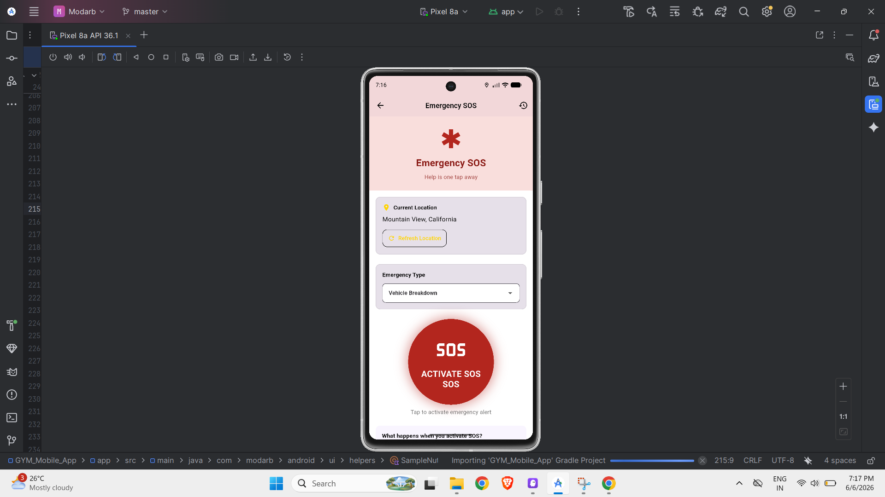
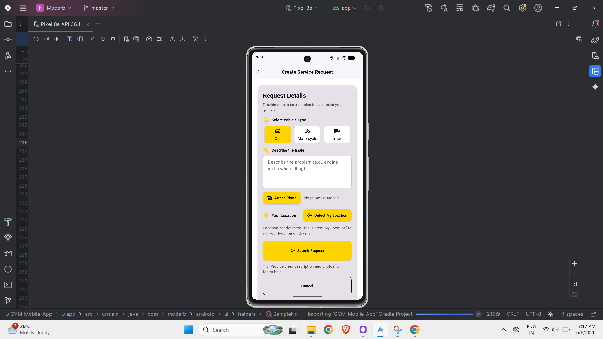
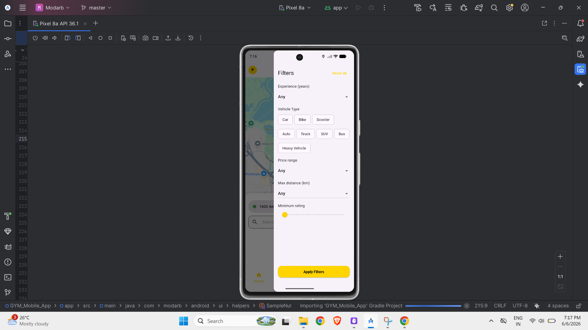
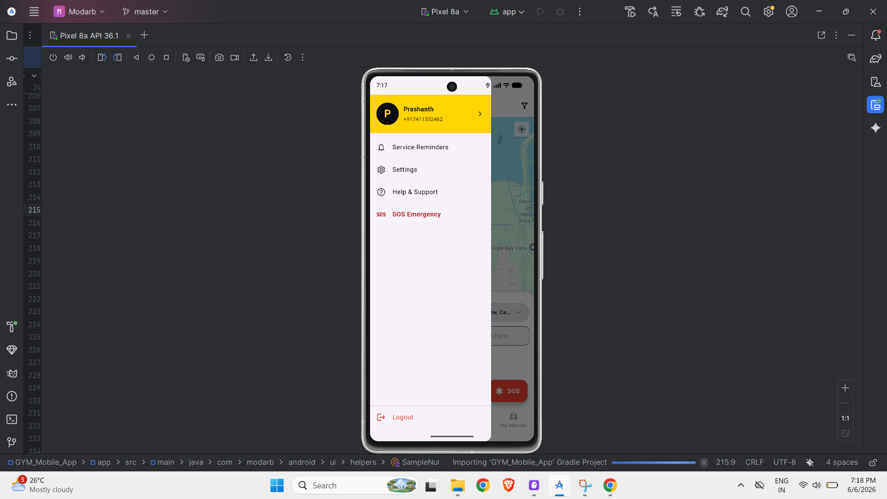

# 🚗 MechResQ - Emergency Roadside Assistance App

[](https://flutter.dev)
[](https://firebase.google.com)
[](LICENSE)

**MechResQ** is a comprehensive emergency roadside assistance mobile application built with Flutter. It connects users with nearby mechanics during vehicle emergencies, providing real-time tracking, SOS features, and seamless communication.

---

## 📋 Table of Contents

- [Features](#-features)
- [Screenshots](#-screenshots)
- [Architecture](#-architecture)
- [Tech Stack](#-tech-stack)
- [Project Structure](#-project-structure)
- [Getting Started](#-getting-started)
- [Configuration](#-configuration)
- [Localization](#-localization)
- [Firebase Setup](#-firebase-setup)
- [Permissions](#-permissions)
- [Build & Run](#-build--run)
- [Key Services](#-key-services)
- [Contributing](#-contributing)
- [License](#-license)

---

## 🚀 Features

### Core Features
- 🆘 **Emergency SOS** - Quick access to emergency assistance with one tap
- 📍 **Real-time Location Tracking** - Live mechanic tracking with Google Maps integration
- 🔍 **Find Nearby Mechanics** - Discover mechanics based on your current location
- 💬 **In-app Chat** - Direct communication with assigned mechanics
- ⭐ **Ratings & Reviews** - Rate and review mechanic services
- 📱 **Service Request Management** - Create, track, and manage service requests

### User Management
- 🔐 **Multi-auth Support** - Email/Password and Google Sign-In
- 👤 **Profile Management** - Complete user profile with personal and vehicle information
- 🚙 **Vehicle Management** - Add and manage multiple vehicles
- 👥 **Emergency Contacts** - Store and manage emergency contact information
- 🔔 **Service Reminders** - Schedule and receive vehicle service reminders

### Additional Features
- 🌍 **Multi-language Support** - English and Kannada (more languages planned)
- 🌙 **Dark/Light Theme** - Hazard-focused theme with customizable appearance
- 🔔 **Push Notifications** - Real-time notifications for service updates
- 📊 **Request History** - View all past service requests
- 🆘 **SOS History** - Track all emergency events
- 📄 **Legal & Support** - Terms, Privacy Policy, and Help documentation

---

## 📱 Screenshots

<div align="center">

### Login Screen


*Phone number authentication with OTP verification*

---

### Home Screen


*Interactive map showing nearby mechanics with search functionality*

---

### Emergency SOS


*One-tap emergency assistance with location sharing*

---

### Create Service Request


*Detailed service request form with vehicle type selection*

---

### Filters


*Advanced filtering by vehicle type, distance, and ratings*

---

### Side Drawer


*Quick navigation to profile, reminders, settings, and emergency*

</div>

> **Note:** To add screenshots, save the images in the `screenshots/` directory with the names shown above. See `screenshots/README.md` for detailed guidelines.

---

## 🏗️ Architecture

MechResQ follows a **feature-based architecture** with clear separation of concerns:

```
lib/
├── core/           # Core utilities and constants
├── l10n/           # Localization files (English & Kannada)
├── models/         # Data models
├── screens/        # UI screens (29 screens)
├── services/       # Business logic and Firebase integration
├── utils/          # Helper utilities
├── widgets/        # Reusable UI components
├── locale_provider.dart    # Language management
├── theme_controller.dart   # Theme management
├── theme.dart              # App theming
└── main.dart              # App entry point
```

### Design Patterns
- **Provider** for state management
- **Service Layer** for business logic separation
- **Repository Pattern** for data access
- **Singleton Pattern** for Firebase services

---

## 🛠️ Tech Stack

### Frontend
- **Flutter** 3.10+ - Cross-platform UI framework
- **Material Design 3** - Modern UI components
- **Provider** - State management solution

### Backend & Services
- **Firebase Authentication** - User authentication (Email, Google)
- **Cloud Firestore** - Real-time NoSQL database
- **Firebase Storage** - Image and file storage
- **Firebase Cloud Messaging** - Push notifications

### Maps & Location
- **Google Maps Flutter** - Map integration
- **Geolocator** - Location services
- **Geocoding** - Address resolution

### Additional Packages
- **flutter_localizations** - Internationalization
- **intl** - Date/time formatting and localization
- **cached_network_image** - Efficient image loading
- **image_picker** - Camera and gallery access
- **url_launcher** - External link handling
- **flutter_secure_storage** - Secure data storage
- **permission_handler** - Runtime permissions
- **timezone** - Timezone handling

---

## 📁 Project Structure

```
MechResQ_App/
├── android/                    # Android native code
├── ios/                        # iOS native code
├── assets/                     # Images, icons, and assets
│   ├── icons/                 # App icons
│   └── mechresq_logo.png      # App logo
├── lib/
│   ├── core/                  # Core utilities
│   ├── l10n/                  # Localization
│   │   ├── app_en.arb        # English translations (264+ strings)
│   │   ├── app_kn.arb        # Kannada translations (264+ strings)
│   │   └── app_localizations.dart
│   ├── models/                # Data models
│   │   ├── emergency_contact.dart
│   │   ├── request_tracking.dart
│   │   ├── service_reminder.dart
│   │   ├── sos_event.dart
│   │   └── vehicle.dart
│   ├── screens/               # UI Screens (29 screens)
│   │   ├── login_screen.dart
│   │   ├── home_screen.dart
│   │   ├── create_request_screen.dart
│   │   ├── track_mechanic_screen.dart
│   │   ├── live_tracking_map_screen.dart
│   │   ├── chat_mechanic_screen.dart
│   │   ├── profile_screen.dart
│   │   ├── my_vehicles_screen.dart
│   │   ├── service_reminders_screen.dart
│   │   ├── sos_screen.dart
│   │   ├── settings_screen.dart
│   │   └── ... (20+ more screens)
│   ├── services/              # Business logic services
│   │   ├── auth_service.dart
│   │   ├── firestore_service.dart
│   │   ├── location_service.dart
│   │   ├── notification_service.dart
│   │   ├── request_service.dart
│   │   ├── sos_service.dart
│   │   └── ... (12 services total)
│   ├── utils/                 # Helper utilities
│   ├── widgets/               # Reusable components
│   ├── locale_provider.dart   # Language management
│   ├── theme_controller.dart  # Theme management
│   ├── theme.dart            # App theming
│   └── main.dart             # Entry point
├── test/                      # Unit and widget tests
├── pubspec.yaml              # Dependencies
├── l10n.yaml                 # Localization config
└── README.md                 # This file
```

---

## 🚀 Getting Started

### Prerequisites

- **Flutter SDK** 3.10.0 or higher
- **Dart SDK** 3.10.0 or higher
- **Android Studio** / **Xcode** (for mobile development)
- **Firebase Account** (for backend services)
- **Google Maps API Key** (for map features)

### Installation

1. **Clone the repository**
   ```bash
   git clone <repository-url>
   cd MechResQ_App
   ```

2. **Install dependencies**
   ```bash
   flutter pub get
   ```

3. **Generate localization files**
   ```bash
   flutter gen-l10n
   ```

4. **Configure Firebase** (see [Firebase Setup](#-firebase-setup))

5. **Add Google Maps API Key** (see [Configuration](#-configuration))

6. **Run the app**
   ```bash
   flutter run
   ```

---

## ⚙️ Configuration

### Google Maps API Key

1. Get an API key from [Google Cloud Console](https://console.cloud.google.com/)
2. Enable **Maps SDK for Android** and **Maps SDK for iOS**
3. Add the key to:

**Android:** `android/app/src/main/AndroidManifest.xml`
```xml
<meta-data
    android:name="com.google.android.geo.API_KEY"
    android:value="YOUR_API_KEY_HERE"/>
```

**iOS:** `ios/Runner/AppDelegate.swift`
```swift
GMSServices.provideAPIKey("YOUR_API_KEY_HERE")
```

### Environment Variables

Create a `.env` file (if needed) for sensitive configuration:
```env
GOOGLE_MAPS_API_KEY=your_api_key_here
FIREBASE_API_KEY=your_firebase_key_here
```

---

## 🌍 Localization

MechResQ supports **multi-language internationalization**:

### Supported Languages
- 🇬🇧 **English** (en) - Complete
- 🇮🇳 **Kannada** (kn) - Complete (264+ strings)

### Future Languages (Planned)
- Hindi (hi)
- Tamil (ta)
- Telugu (te)
- Malayalam (ml)
- Bengali (bn)
- Marathi (mr)
- Gujarati (gu)
- Punjabi (pa)
- Odia (or)
- Urdu (ur)

### Localization Coverage
- ✅ **29 screens** fully localized
- ✅ **264+ strings** translated
- ✅ **100% UI coverage**
- ✅ Dynamic language switching
- ✅ Localized data display (states, languages, gender)

### How Localization Works

1. **Storage**: Data is stored in English keys in Firebase (e.g., "Karnataka", "Male")
2. **Display**: UI displays localized names based on current app language
3. **Switching**: Users can change language in Settings → Language
4. **Persistence**: Language preference is saved using SharedPreferences

### Adding a New Language

1. Create a new ARB file: `lib/l10n/app_<locale>.arb`
2. Copy `app_en.arb` and translate all strings
3. Add locale to `l10n.yaml`:
   ```yaml
   arb-dir: lib/l10n
   template-arb-file: app_en.arb
   output-localization-file: app_localizations.dart
   ```
4. Add to `main.dart` supported locales:
   ```dart
   supportedLocales: const [
     Locale('en'),
     Locale('kn'),
     Locale('hi'), // New language
   ]
   ```
5. Run `flutter gen-l10n`

---

## 🔥 Firebase Setup

### 1. Create Firebase Project
1. Go to [Firebase Console](https://console.firebase.google.com/)
2. Create a new project or use existing
3. Add Android and/or iOS app

### 2. Download Configuration Files

**Android:**
- Download `google-services.json`
- Place in `android/app/`

**iOS:**
- Download `GoogleService-Info.plist`
- Place in `ios/Runner/`

### 3. Enable Firebase Services

Enable the following in Firebase Console:

- ✅ **Authentication**
  - Email/Password
  - Google Sign-In
- ✅ **Cloud Firestore**
  - Create database (start in test mode)
- ✅ **Cloud Storage**
  - Create storage bucket
- ✅ **Cloud Messaging**
  - Enable for push notifications

### 4. Firestore Security Rules

```javascript
rules_version = '2';
service cloud.firestore {
  match /databases/{database}/documents {
    // Users collection
    match /users/{userId} {
      allow read: if request.auth != null;
      allow write: if request.auth != null && request.auth.uid == userId;
    }
    
    // Service requests
    match /requests/{requestId} {
      allow read: if request.auth != null;
      allow create: if request.auth != null;
      allow update: if request.auth != null;
    }
    
    // Reviews
    match /reviews/{reviewId} {
      allow read: if request.auth != null;
      allow create: if request.auth != null;
    }
  }
}
```

### 5. Storage Rules

```javascript
rules_version = '2';
service firebase.storage {
  match /b/{bucket}/o {
    match /profile_pictures/{userId}/{fileName} {
      allow read: if request.auth != null;
      allow write: if request.auth != null && request.auth.uid == userId;
    }
    
    match /request_images/{requestId}/{fileName} {
      allow read: if request.auth != null;
      allow write: if request.auth != null;
    }
  }
}
```

---

## 🔐 Permissions

### Android Permissions (`AndroidManifest.xml`)

```xml
<!-- Location -->
<uses-permission android:name="android.permission.ACCESS_FINE_LOCATION"/>
<uses-permission android:name="android.permission.ACCESS_COARSE_LOCATION"/>
<uses-permission android:name="android.permission.ACCESS_BACKGROUND_LOCATION"/>

<!-- Notifications -->
<uses-permission android:name="android.permission.POST_NOTIFICATIONS"/>

<!-- Camera -->
<uses-permission android:name="android.permission.CAMERA"/>

<!-- Storage (Android 12 and below) -->
<uses-permission android:name="android.permission.READ_EXTERNAL_STORAGE"/>
<uses-permission android:name="android.permission.WRITE_EXTERNAL_STORAGE"/>

<!-- Media (Android 13+) -->
<uses-permission android:name="android.permission.READ_MEDIA_IMAGES"/>
<uses-permission android:name="android.permission.READ_MEDIA_VIDEO"/>
```

### iOS Permissions (`Info.plist`)

Add the following keys to `ios/Runner/Info.plist`:

```xml
<key>NSLocationWhenInUseUsageDescription</key>
<string>We need your location to find nearby mechanics</string>

<key>NSLocationAlwaysUsageDescription</key>
<string>We need your location for real-time tracking</string>

<key>NSCameraUsageDescription</key>
<string>We need camera access to take photos of vehicle issues</string>

<key>NSPhotoLibraryUsageDescription</key>
<string>We need photo library access to select images</string>
```

---

## 🔨 Build & Run

### Development Build

```bash
# Run on connected device/emulator
flutter run

# Run on specific device
flutter devices
flutter run -d <device-id>

# Run with specific locale
flutter run --dart-define=INITIAL_LOCALE=kn
```

### Production Build

**Android APK:**
```bash
flutter build apk --release
```

**Android App Bundle (Play Store):**
```bash
flutter build appbundle --release
```

**iOS:**
```bash
flutter build ios --release
```

### Debug Commands

```bash
# Analyze code
flutter analyze

# Run tests
flutter test

# Check dependencies
flutter pub outdated

# Clean build cache
flutter clean
flutter pub get
```

---

## 🔧 Key Services

### Authentication Service (`auth_service.dart`)
- User registration and login
- Google Sign-In integration
- Password reset
- Session management

### Firestore Service (`firestore_service.dart`)
- User profile CRUD operations
- Data synchronization
- Real-time updates

### Location Service (`location_service.dart`)
- Get current location
- Track location changes
- Calculate distances
- Geocoding and reverse geocoding

### Request Service (`request_service.dart`)
- Create service requests
- Track request status
- Assign mechanics
- Request history

### Notification Service (`notification_service.dart`)
- Local notifications
- Push notifications (FCM)
- Notification channels
- Scheduled reminders

### SOS Service (`sos_service.dart`)
- Emergency alert system
- Send distress signals
- Contact emergency contacts
- Location sharing

### Review Service (`review_service.dart`)
- Submit ratings and reviews
- View mechanic reviews
- Calculate average ratings

### Vehicle Service (`vehicle_service.dart`)
- Add/edit/delete vehicles
- Vehicle information management
- Service history

---

## 📊 App Statistics

- **Total Screens:** 29
- **Total Services:** 12
- **Total Models:** 5
- **Localized Strings:** 264+ (per language)
- **Supported Languages:** 2 (English, Kannada)
- **Firebase Services:** 4 (Auth, Firestore, Storage, Messaging)
- **Total Dart Files:** 67+

---

## 🎨 Theming

MechResQ uses a **hazard-focused theme** with:

- **Primary Color:** High-visibility orange/yellow
- **Dark Theme:** Available for low-light conditions
- **Material Design 3:** Modern, accessible UI components
- **Custom Theme Controller:** Dynamic theme switching

---

## 🧪 Testing

```bash
# Run all tests
flutter test

# Run specific test file
flutter test test/widget_test.dart

# Run with coverage
flutter test --coverage

# View coverage report
genhtml coverage/lcov.info -o coverage/html
open coverage/html/index.html
```

---

## 🤝 Contributing

We welcome contributions! Please follow these guidelines:

1. Fork the repository
2. Create a feature branch (`git checkout -b feature/amazing-feature`)
3. Commit your changes (`git commit -m 'Add amazing feature'`)
4. Push to the branch (`git push origin feature/amazing-feature`)
5. Open a Pull Request

### Code Style
- Follow [Effective Dart](https://dart.dev/guides/language/effective-dart) guidelines
- Use meaningful variable and function names
- Add comments for complex logic
- Write tests for new features

---

## 📝 License

This project is proprietary software. All rights reserved.

---

## 👥 Team

Developed with ❤️ by the MechResQ Team

---

## 📞 Support

For support, email support@mechresq.com or open an issue in the repository.

---

## 🗺️ Roadmap

### Version 1.1 (Upcoming)
- [ ] Add more languages (Hindi, Tamil, Telugu)
- [ ] Mechanic app (separate app for mechanics)
- [ ] Payment integration
- [ ] Advanced analytics dashboard

### Version 1.2 (Future)
- [ ] AI-powered issue diagnosis
- [ ] Video call support
- [ ] Subscription plans
- [ ] Referral system

---

## 📚 Additional Resources

- [Flutter Documentation](https://docs.flutter.dev/)
- [Firebase Documentation](https://firebase.google.com/docs)
- [Google Maps Flutter Plugin](https://pub.dev/packages/google_maps_flutter)
- [Provider Package](https://pub.dev/packages/provider)

---

**Made with Flutter 💙**
